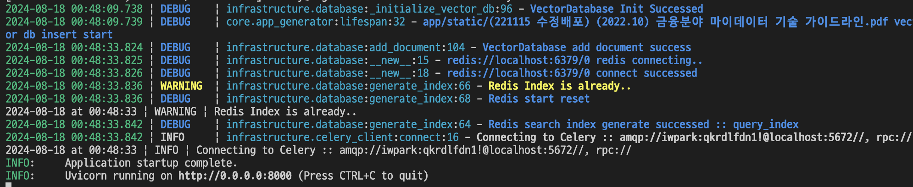
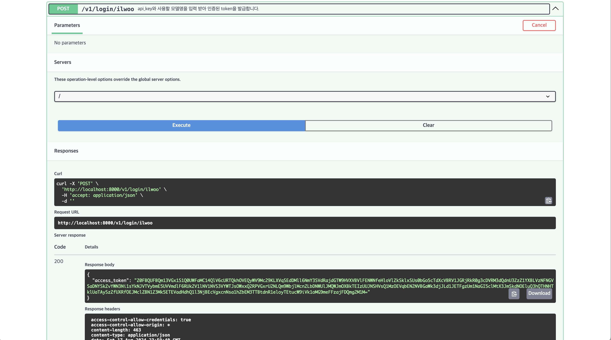
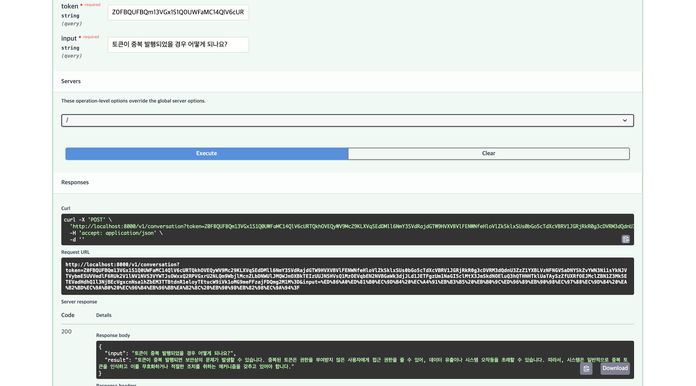
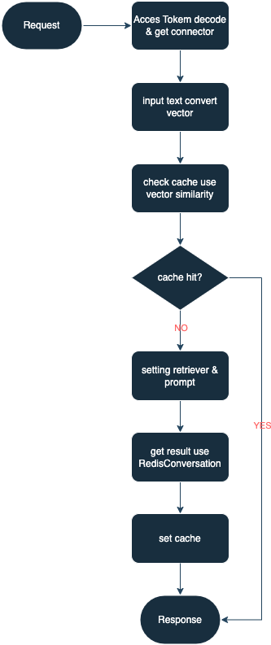

# MY Agnet App

## 개발환경
* (필수) Python 3.10^
* (필수) docker 20.10.17^
* (필수) docker-compose 2.10.2^

## network 정보
* 필요한 포트: 8000(FastAPI), 6379(Redis), 5672(RabbitMQ)

## 사용한 라이브러리
* app
    * langchain==0.2.12
    * langchain-community==0.2.11
    * sentence-transformers==3.0.1
    * pypdf==4.3.1
    * faiss-cpu==1.8.0.post1
    * langchain-huggingface==0.0.3
    * langchain-openai==0.1.20
    * langchainhub==0.1.20
    * fastapi==0.112.0
    * cryptography==43.0.0
    * pytest-asyncio==0.23.8
    * uvicorn==0.30.5
    * pydantic-settings==2.4.0
    * aioredis==2.0.1
    * celery==5.4.0
    * msgpack==1.0.8
    * loguru==0.7.2
    * pyttsx3==2.90
    * redisearch==2.1.1
* inferecne(추론용 서버)
    * celery==5.4.0
    * msgpack==1.0.8
    * sentence-transformers==3.0.1

## 실행방법
* pre-settings: `pip install -r app/requirements.txt`
1. `docker-compose -f docker-compose.yml up --build` 명령어로 redis와 rabbitMQ를 실행합니다.
2. `cd inference && celery -A worker worker --loglevel=info --pool=solo` 명령어로 celery를 실행합니다.
3. `python3 app/main.py` 명령어로 FastAPI앱을 실행합니다. 아래와 같은 상태가 되어야 FastAPI 로드가 끝납니다.

4. `v1/login/ilwoo` API로 AccessToken을 받습니다.

5. `v1/conversation` API에 4번에서 받은 token과 질의를 입력합니다.

## 흐름도
### App 시작

1. app/static 안에 있는 모든 파일을 읽는다.
2. embedding을 위해 document 객체로 변환한다.
3. FAISS에 vector를 적재한다.

### 질의 응답

1. OpenAI api-key와 사용할 Model 명을 입력하여 AccessToken을 발급받는다.
    * 발급받으신 key가 없다면 `/login/ilwoo` API 사용 
2. 해당 토큰과 모델명으로 connection을 확인한다.
3. 입력받은 질문을 PostProcessing 한다.
4. PostProcessing한 데이터를 Inferecne서버(Celery)로 embedding 요청을 한다.
5. vector값이 넘어오면 redisearch를 이용해 vector 유사도 검색으로 이전에 질의한 내용과 비슷한지 체크한다.
6. 만약 이전에 질의, 응답한 내용이 있다면(Cache hit) 바로 응답을 보낸다.
7. Cache miss시에는 FAISS에서 retriever를 가져오고, prompt를 이용해 질의한다.
8. 나온 응답값을 value로 설정하여 redis에 설정한다.

## 구현 설명
1. LangChain 적극 사용
2. LangChain의 create_history_aware_retriever, create_retrieval_chain 사용하여 멀티턴 구현
3. 추상화를 통한 객체지향적으로 개발하여 확장성에 용이. 또 한, RestAPI를 처리하는 서버와 GPU 자원을 사용하는 서버를 분리하여 추후 스케일업 & 스케일아웃에 용이
4. 동시성 해결
    * FastAPI의 router를 async로 하여 각각의 워커에서는 main thread 하나만 구동되도록 설정하여 코드 레벨의 동시성 방지
    * 동시성 이슈가 발생할 수 있을만한 Embedding 과정은 Celery를 통해 하나씩 처리할 수 있도록 하여 동시성 방지
5. 이전 대화를 요약하는 방식으로 토큰의 제한을 억제

## 아쉬운점 및 느낀점
핑계거리 밖에 될 수 없지만 시간이 많이 부족했습니다. 분명 절대적으로 주어진 시간은 굉장히 많았지만, 예상치 못한 재직중인 회사의 업무 일정(야근 및 주말,공휴일 출근)과 가족의 건강 약화로 시간이 많이 부족하여 구현하지 못한점이 많습니다.

과제를 시작했던 시점에서는 딱히 큰 이슈가 없어 퀄리티 좋은 나만의 RAG 서비스(https://www.danswer.ai/ 참고)을 만드려고 큰 구상 및 설계를 했지만, 막상 구현을 많이 하지 못한 기능도 많습니다.(문서 업로드 기능 및 프론트 연동)

langchain을 처음 써보다보니, 랭체인을 쓰지 않고 구현을 해보다가 추후에 랭체인에 이미 구현된 기능이 많아 다시 랭체인으로 변환하는 등 불필요한 작업에 시간을 많이 소비했습니다.

또 한, 마지막에 알 수 없는 이유로 redis의 캐싱 기능과 docker-compose를 이용한 애플리케이션 구동 기능을 빼게 되었습니다.

마지막으로 테스트코드에 너무 많은 시간을 할애하여, 전반적인 완성도가 낮은점이 후회가 많이 됩니다.

하지만 앞선 후회속에도 이번 과제를 통해서 랭체인의 엄청난 편리함을 배웠고, 테스트코드 작성을 조금 더 경험 하였으며, 마지막으로 적절히 시간을 할애하는 법을 배웠습니다!
